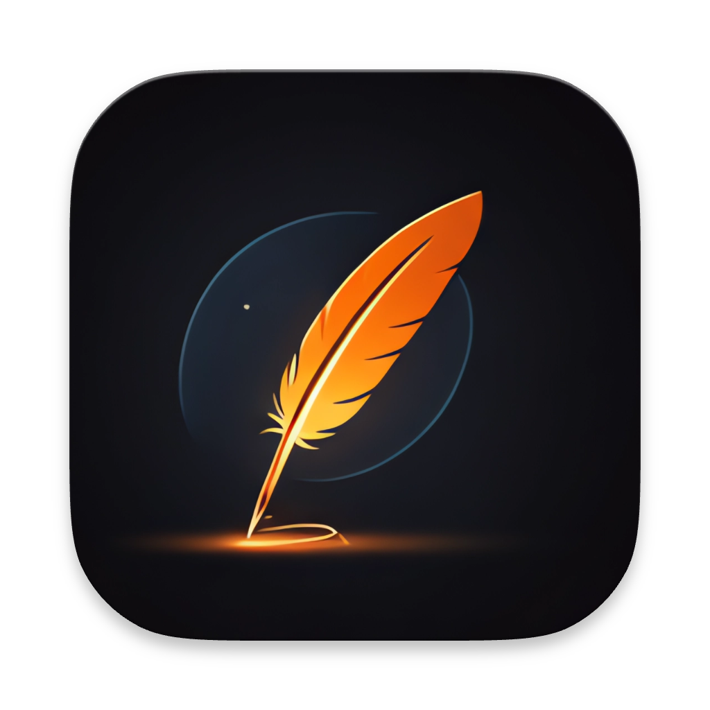
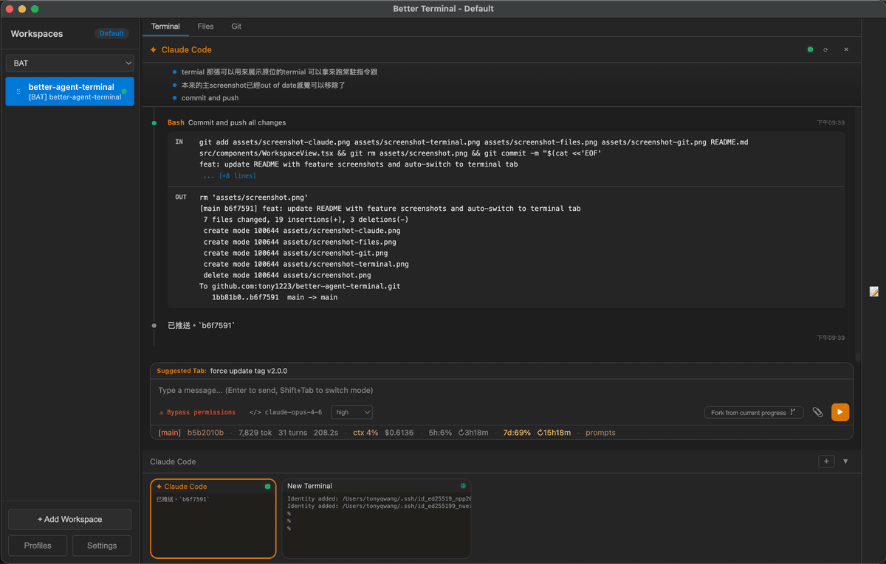
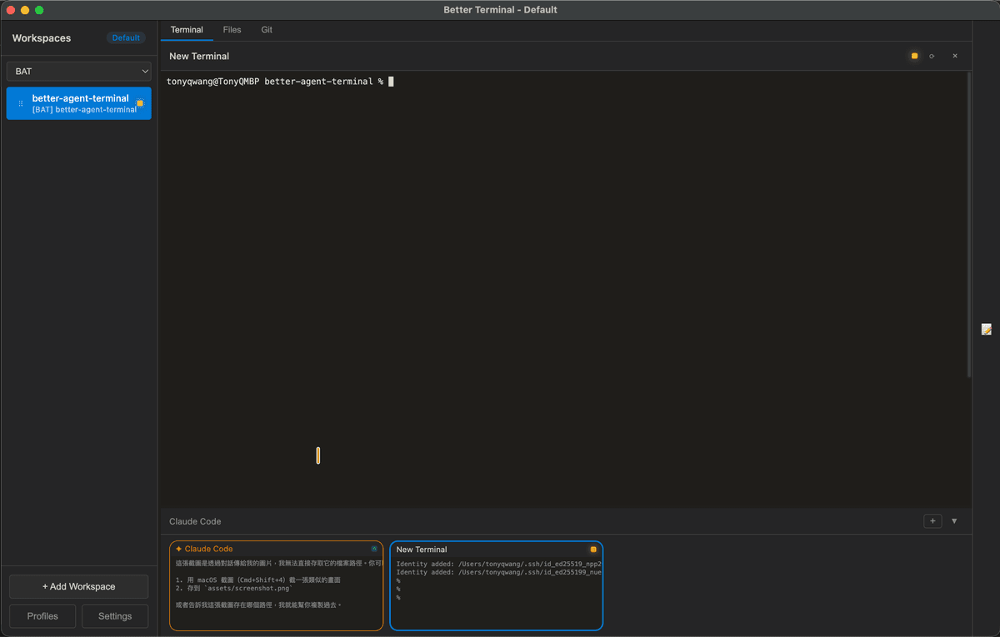
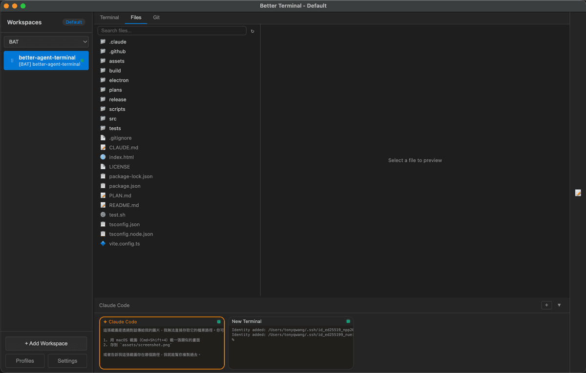
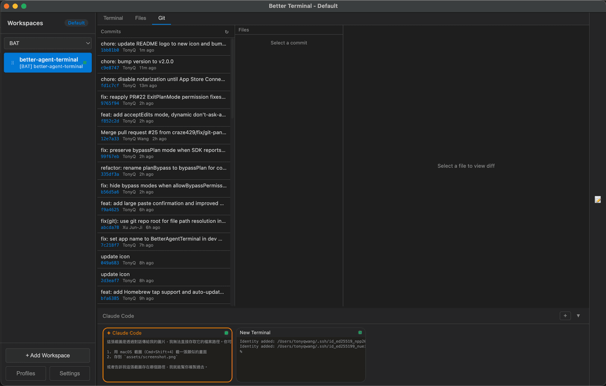

# Better Agent Terminal

<div align="center">




**A Tauri-powered terminal aggregator with multi-workspace support and built-in AI agent integration**

Manage multiple project terminals in one window, with built-in Claude Code and Codex agent panels, file browser, git viewer, snippet manager, and remote access — all in a single Tauri app.

Version 3.0 is the Tauri-only release. The Electron runtime has been removed; the app now uses a Rust/Tauri host, a React renderer, and a small bundled Node sidecar only where JavaScript SDK/runtime support is still required.

[Download Latest Release](https://github.com/tony1223/better-agent-terminal/releases/latest)

### Mobile Apps

Mobile apps require Better Agent Terminal **v3.1.3 or later**.

<table>
  <tr>
    <th>iOS TestFlight</th>
    <th>Android</th>
  </tr>
  <tr>
    <td align="center">
      <a href="https://l.tonyq.org/bat-ios">https://l.tonyq.org/bat-ios</a><br>
      
    </td>
    <td align="center">
      <a href="https://l.tonyq.org/bat-android">https://l.tonyq.org/bat-android</a><br>
      
    </td>
  </tr>
</table>

</div>

---

## Screenshots

<div align="center">

**Claude Code Agent Panel** — Built-in AI agent with permission controls, status line, and streaming output


**Terminal** — Run persistent terminals alongside your agent for long-running commands and monitoring


**File Browser** — Browse and preview project files without leaving the app


**Git Viewer** — View commit history and diffs at a glance


</div>

---

## Features

### Workspace Management
- **Multi-Workspace** — Organize terminals by project folders; each workspace binds to a directory
- **Drag & Drop** — Reorder workspaces freely in the sidebar
- **Groups** — Categorize workspaces into named groups with a filter dropdown
- **Profiles** — Save and switch between multiple workspace configurations (local or remote)
- **Detachable Windows** — Pop out individual workspaces to separate windows; auto-reattach on restart
- **Per-Workspace Env Vars** — Configure custom environment variables per workspace
- **Activity Indicators** — Visual dots showing which workspaces have active terminal processes
- **Double-click to rename**, right-click context menu for all workspace actions

### Terminal
- **Split-panel layout** — 70% main panel + 30% scrollable thumbnail bar showing all terminals
- **Multiple terminals per workspace** — Powered by xterm.js with full Unicode/CJK support
- **Agent presets** — Pre-configured terminal roles: Claude Code, Claude Code (worktree), Codex Agent, or plain terminal
- **Git worktree isolation** — Spawn Claude agents in an isolated worktree to prevent destructive changes to your main working tree
- **Tab navigation** — Switch between Terminal, Files, and Git views per workspace
- **File browser** — Search, navigate, and preview files with syntax highlighting (highlight.js)
- **Git integration** — Commit log, diff viewer, branch display, untracked file list, GitHub link detection
- **GitHub panel** — Browse PRs and issues directly from the Git tab
- **Snippet manager** — Save, organize, search, and paste code snippets (SQLite-backed with categories and favorites)
- **Markdown preview** — Preview `.md` files in a dedicated right sidebar panel with live file watching and right-click context menu
- **Worker panel (Procfile)** — Run multiple processes from a [Procfile](https://github.com/DarthSim/overmind?tab=readme-ov-file#procfile-format) in a single tab with combined log view and per-process start/stop/restart controls, inspired by [Overmind](https://github.com/DarthSim/overmind)
- **Per-terminal prompt history** — Access previous commands per terminal session

### Claude Code Agent
- **Built-in Claude Code** via SDK — Runs the agent directly inside the app; no separate terminal needed
- **Message streaming** with extended thinking blocks (collapsible)
- **Permission modes** — Multiple levels of tool execution control:
  - **Default** — Approve each tool call individually
  - **Accept Edits** — Auto-approve file edits, prompt for other tools
  - **Plan mode** — Agent proposes a plan file first; approve the plan to auto-execute
  - **Bypass** — Full auto-approval (use with caution)
- **Subagent tracking** — See spawned subagent tasks with progress indicators, elapsed time, and stall detection
- **Session resume** — Persist conversations and resume them across app restarts
- **Session fork** — Branch off from any point in a conversation with pending prompt auto-send
- **Rest/Wake sessions** — Pause and resume agent sessions from the context menu to save resources
- **Effort level** — Configure default effort level (high/medium/low) for new agent sessions
- **Auto-compact** — Automatically compact context when token count exceeds a configurable threshold

#### Statusline
A configurable status bar at the bottom of the agent panel, with 15 items across three zones (left / center / right):

| Item | Description |
|---|---|
| Session ID | First 8 chars of SDK session ID (click to resume a past session) |
| Git Branch | Current git branch name |
| Tokens | Total input + output token count (click for context breakdown) |
| Turns | Number of conversation turns |
| Duration | Session duration |
| Context % | Percentage of context window used (color-coded) |
| Cost | Total session cost in USD |
| Workspace | Current workspace name |
| 5h Usage / Reset | 5-hour API rate limit usage and reset countdown |
| 7d Usage / Reset | 7-day API rate limit usage and reset countdown |
| Max Output | Maximum output tokens for current model |
| Cache Eff. | Cache read efficiency percentage (click for cache history with per-turn cost breakdown) |
| Prompts | Link to view prompt history |

Items can be reordered, colored, and toggled on/off via a drag-and-drop template editor in Settings.

#### Cache Cost Awareness
- **Cache history** — Per-turn cache read/write breakdown with cost calculations per model (Opus, Sonnet, Haiku)
- **Cache TTL countdown** — Optional floating badge in the top-right corner showing remaining time for 5-minute and 1-hour cache TTLs; updates every 30 seconds, only appears after 1 minute of idle
- **Cache expiry warning** — Pre-send confirmation dialog when >150k cached tokens have expired (>1 hour), preventing accidental full-price reprocessing

#### Account & Usage
- **Multi-account switching** — `/switch` to manage and switch between multiple Claude accounts
- **Usage monitoring** — Track API rate limits (5-hour and 7-day windows) via Anthropic OAuth or Chrome session key
- **Context usage panel** — Visualize token usage breakdown by category (code, conversation, tools, memory, MCP, etc.)

#### UI & Interaction
- **Image attachment** — Drag-drop or use the attach button (up to 5 images per message)
- **Clickable URLs** — Markdown links and bare URLs open in the default browser
- **Clickable file paths** — Click any file path in agent output to preview it with syntax highlighting and search (Ctrl+F)
- **Ctrl+P file picker** — Fuzzy-search project files and attach them to the conversation context
- **Skills & Agents panels** — Browse available slash commands and agent configurations in the right sidebar
- **Markdown preview search** — In-pane Ctrl+F search inside markdown previews and file previews
- **Long MCP tool output collapse** — Auto-collapse oversized MCP tool results with a one-click expand
- **Notifications** — Dock badge, sound, and system notifications on agent completion (configurable)
- **Update notifications** — Automatic check for new releases on GitHub

### Codex Agent

Optional alternate agent backend powered by [`@openai/codex-sdk`](https://www.npmjs.com/package/@openai/codex-sdk). Pick **Codex Agent** (or **Codex Agent (worktree)**) from the agent preset list when creating a terminal.

- **GPT-5.5 / 5.4 / 5.3-codex / o4-mini / o3 / GPT-4.1** — Switch models inline; ChatGPT login or OpenAI API key
- **Sandbox modes** — `read-only`, `workspace-write`, or `danger-full-access`
- **Approval policies** — `untrusted`, `on-request`, or `never` (auto)
- **Worktree preset** — Spawn Codex in an isolated git worktree, same as the Claude worktree flow
- **Session resume** — JSONL transcripts under `~/.codex/sessions/` are auto-indexed; resume hits a local cache so re-opening a thread is fast even with months of history
- **Inline plan approval** — Codex `plan` items render as approvable blocks in the panel

### Semantic Code Navigation (cx)

Optional integration with [`cx`](https://github.com/ind-igo/cx) — a tree-sitter-based CLI that gives agents file overviews, symbol search, definitions, and references without spinning up a language server. Useful for cutting context tokens on large codebases: agents can run `cx overview` (~20 tokens) before deciding which files to actually read.

When enabled in **Settings → Agents → cx semantic navigation**, BAT:
- Detects `cx` on `PATH` (or uses a custom binary path)
- Appends a short system-prompt section telling the agent to prefer `cx overview / symbols / definition / references` over full file reads
- Sets `CX_CACHE_DIR` to a per-app cache directory so repeated queries are fast

**Install:**

| Platform | Command |
|---|---|
| macOS (Homebrew) | `brew tap ind-igo/cx && brew install cx` |
| Cargo | `cargo install cx-cli` |
| macOS / Linux (script) | `curl -sL https://raw.githubusercontent.com/ind-igo/cx/master/install.sh \| sh` |
| Windows (PowerShell) | `irm https://raw.githubusercontent.com/ind-igo/cx/master/install.ps1 \| iex` |

After installing, run `cx lang add <language>` for each language you want grammars for (e.g. `rust`, `typescript`, `python`), then toggle the option in BAT settings. The toggle is off by default — agents continue to work normally without `cx` installed.

### Internationalization (i18n)
- **English**, **Traditional Chinese (繁體中文)**, **Simplified Chinese (简体中文)**

---

## Keyboard Shortcuts

| Shortcut | Action |
|---|---|
| `` Ctrl+` `` (Windows) | Switch to the next BAT window |
| `` Cmd+` `` (macOS) / `` Ctrl+` `` (Linux) | Toggle between Agent terminal and first regular terminal |
| `Ctrl+←/→` / `Cmd+←/→` | Cycle workspace tabs (Terminal / Files / Git) |
| `Ctrl+↑/↓` / `Cmd+↑/↓` | Switch to previous / next workspace |
| `Ctrl+P` / `Cmd+P` | File picker (search & attach files to agent context) |
| `Ctrl+N` / `Cmd+N` | Open new window |
| `Ctrl+Shift+T` / `Cmd+T` | Open the new-terminal quick-pick (choose Shell, Worktree, Claude / Codex agent…) |
| `Ctrl+Shift+W` / `Cmd+Shift+W` | Close the focused terminal |
| `Shift+Tab` | Switch between Terminal and Agent mode |
| `Enter` | Send message |
| `Shift+Enter` | Insert newline (multiline input) |
| `Escape` | Stop streaming / close modal |
| `Ctrl+Shift+C` | Copy selected text |
| `Ctrl+Shift+V` | Paste from clipboard |
| `Right-click` | Copy (if text selected) or Paste |

## Slash Commands

| Command | Description |
|---|---|
| `/resume` | Resume a previous Claude session from history |
| `/model` | Switch between available Claude models |
| `/new` / `/clear` | Reset session (clear conversation, fresh start) |
| `/abort` | Stop the current agent session immediately |
| `/snippet` | Show snippets to Claude for management |
| `/switch` | Switch between Claude accounts |
| `/login` | Sign in to Claude (switch account) |
| `/logout` | Sign out of Claude |
| `/whoami` | Show current account info and usage |
| `/auto-continue` / `/ac` | Auto-resend a prompt when the agent stops — see [Auto-Continue](#auto-continue) |

### Auto-Continue

Some tasks are too long to finish in a single turn — the agent stops mid-plan, or pauses waiting for the user to say "keep going". `/auto-continue` (alias `/ac`) tells the host to re-send a prompt automatically when the turn ends, up to N times.

**Syntax** (typed into the agent input box):

```
/auto-continue                  # enable, max 3, prompt="繼續"
/auto-continue 5                # enable, max 5, prompt="繼續"
/auto-continue 繼續做完         # enable, max 3, custom prompt
/auto-continue 10 keep going    # enable, max 10, custom prompt
/ac 5                           # short alias
/auto-continue off              # disable (also: /ac stop)
```

**Behavior**

- State lives on the **host** (per-session), so remote clients and other views see the same counter.
- The counter resets to `0` every time you manually send a new message — your own input always restarts the budget.
- Triggers only when the previous turn ended with `subtype=success`; errors, abort, max-turns, or rate-limit halts stop auto-continue.
- Skipped if the session is streaming, aborted, or has queued messages.
- Each auto-sent turn shows `<prompt>  [auto N/max]` in the message list so you can tell the agent didn't type that.
- `/abort` and manual session stop clear the auto-continue state.

**Tips**

- Use a concrete prompt like `/auto-continue 5 請依照 plan 的 step 繼續，做完一步就停下` instead of just `繼續` — the agent behaves more predictably.
- Set a low `max` (3–5) the first time you try it on a new task, then raise it once you trust the loop.
- Turn it off with `/ac off` before a long lunch break — auto-continue will happily burn credits while you're away.

---

## Quick Start

### Option 1: Homebrew (macOS)

```bash
brew install --cask tonyq-org/tap/better-agent-terminal
```

### Option 2: Chocolatey (Windows) *(coming soon)*

```powershell
choco install better-agent-terminal
```

> Package is currently pending review on Chocolatey.org.

### Option 3: Download Release

Download from [Releases](https://github.com/tony1223/better-agent-terminal/releases/latest) for your platform:

| Platform | Format | Architectures |
|---|---|---|
| Windows | NSIS installer, `.zip` | x86_64 |
| macOS | `.dmg` | Apple Silicon (arm64) & Intel (x86_64) |
| Linux | `.AppImage` | x86_64 & arm64/aarch64 |

The x86_64 AppImage keeps its historical name (`BetterAgentTerminal-<version>.AppImage`); the arm64 build is published as `BetterAgentTerminal-<version>-arm64.AppImage`. The [install script](#option-5-quick-install-script) picks the right one automatically.

**Headless / remote server (e.g. ARM cloud hosts):**

The same AppImage doubles as a headless remote server — handy for an arm64 cloud box you drive from a mobile/remote client:

```bash
# arm64 host
./BetterAgentTerminal-<version>-arm64.AppImage --bat-server --help
```

Since it is a WebKitGTK app, on a box with no display server, run it under a virtual display:

```bash
xvfb-run -a ./BetterAgentTerminal-<version>-arm64.AppImage --bat-server
```

**macOS DMG installation:**

1. Download the `.dmg` file from Releases
2. Double-click the `.dmg` to mount it
3. Drag **Better Agent Terminal** into the **Applications** folder
4. On first launch, macOS may block the app — go to **System Settings > Privacy & Security**, scroll down and click **Open Anyway**
5. The Claude Code binary is bundled — no separate install needed. (You can still `npm install -g @anthropic-ai/claude-code` if you prefer to use a system-wide CLI; BAT will pick the global one when present.)

### Option 4: Build from Source

**Prerequisites:**
- [Node.js](https://nodejs.org/) 18+
- [Rust](https://www.rust-lang.org/tools/install) stable toolchain
- Platform build tools for Tauri 2: Xcode Command Line Tools on macOS, Microsoft C++ Build Tools/WebView2 on Windows, or the standard Tauri Linux WebKitGTK dependencies
- A Claude account (sign in via `/login` inside the app, or pre-authenticate the [Claude Code CLI](https://docs.anthropic.com/en/docs/claude-code) — the binary is bundled, no separate global install required)

```bash
git clone https://github.com/tony1223/better-agent-terminal.git
cd better-agent-terminal
corepack enable
pnpm install
```

**Development mode:**
```bash
pnpm run dev
```

**Build for production:**
```bash
pnpm run build
```

For an unsigned local installer/package check, use:

```bash
pnpm run tauri:build:debug
```

### Option 5: Quick Install (Script)

Run the following command in your terminal (macOS, Linux, or Windows with Git Bash/MSYS2):

```bash
curl -fsSL https://raw.githubusercontent.com/tony1223/better-agent-terminal/main/install.sh | bash
```

This script will detect your OS and install the application to the standard location.

### macOS Build Notes

Native dependencies (`node-pty`, `better-sqlite3`) require Xcode Command Line Tools:

```bash
xcode-select --install
```

Then:

```bash
corepack enable
pnpm install
pnpm run dev      # Development
pnpm run build    # Build signed/release package when signing env is configured
pnpm run tauri:build:debug  # Local unsigned package
```

---

## Architecture

```
better-agent-terminal/
├── renderer/                          # React renderer running inside the Tauri webview
│   └── src/
│       ├── App.tsx                    # Root component, layout, profile orchestration
│       ├── components/                # Workspace, terminal, agent, file, git, settings UI
│       ├── stores/                    # Renderer state stores
│       ├── locales/                   # EN / zh-TW / zh-CN translations
│       ├── types/                     # Shared renderer/domain TypeScript types
│       ├── host-api.ts                # Tauri host adapter used by renderer code
│       └── styles/                    # Component-specific styles
├── src-tauri/                         # Tauri host runtime (Rust)
│   ├── src/                           # Commands, PTY, profiles, remote server, sidecar bridge
│   ├── capabilities/                  # Tauri IPC capability declarations
│   ├── windows/                       # Windows installer hooks
│   └── tauri.conf.json                # Tauri app and bundle configuration
├── node-sidecar/                      # Bundled Node sidecar for SDK/runtime pieces not yet native Rust
├── assets/                            # App icons and screenshots
├── scripts/
│   └── build-version.js               # Version string generator
└── package.json
```

### Tech Stack
- **Frontend:** React 18 + TypeScript + i18next (EN / zh-TW / zh-CN)
- **Terminal:** xterm.js + node-pty
- **Framework:** Tauri 2, with Rust as the host/runtime layer
- **AI:** `@anthropic-ai/claude-agent-sdk` + bundled `@anthropic-ai/claude-code` binary (Claude); `@openai/codex-sdk` (Codex Agent)
- **Build:** Vite + Tauri
- **Storage:** better-sqlite3 (snippets, session data)
- **Remote:** Rust WebSocket server/client + QR code connection flow
- **Syntax Highlighting:** highlight.js

---

## Remote Access & Mobile Connect

BAT includes a built-in WebSocket server that allows other BAT instances or mobile devices to connect and control it remotely. This feature is currently **experimental**.

### How It Works

1. The **Host** enables the WebSocket server in Settings → Remote Access (default port: 9876)
2. On startup, the server generates a **Connection Token** (32-character hex string) used to authenticate connections
3. The **Client** connects by entering the host IP, port, and token via a Remote Profile
4. Once connected, the client can operate all terminals, Claude Agent sessions, workspaces, and other features on the host

### Connection Methods

#### Method 1: Remote Profile (BAT-to-BAT)

On the client BAT instance:

1. Open Settings → Profiles
2. Create a new profile and set the type to **Remote**
3. Enter the host IP, port (9876), and token
4. Load the profile to connect to the remote host

#### Method 2: QR Code (Mobile Devices)

On the host BAT instance:

1. Open Settings → Remote Access → **Generate QR Code**
2. If the server is not yet running, it will start automatically
3. Scan the QR code with a mobile device to retrieve the connection info
4. The QR code contains the WebSocket URL and token (in JSON format)

### Recommended: Use Tailscale for Cross-Network Connections

If the host and client are not on the same local network (e.g., connecting from home to an office machine), we recommend using [Tailscale](https://tailscale.com/) to establish a secure peer-to-peer VPN:

- **Free plan** supports up to 100 devices
- No port forwarding or additional server setup required
- Each device gets a stable `100.x.x.x` IP address
- BAT automatically detects Tailscale IPs and uses them preferentially

**Installation:**

| Platform | Install |
|----------|---------|
| macOS | [Download](https://tailscale.com/download/macos) or `brew install tailscale` |
| Windows | [Download](https://tailscale.com/download/windows) |
| iOS | [App Store](https://apps.apple.com/app/tailscale/id1470499037) |
| Android | [Google Play](https://play.google.com/store/apps/details?id=com.tailscale.ipn) |
| Linux | [Install Guide](https://tailscale.com/download/linux) |

After installation, sign in with the same account on all devices and they will be able to communicate. BAT's QR code will automatically use the Tailscale IP.

### Security Notice

> **Warning:** Enabling the Remote Server opens a WebSocket connection. Any device with the token can fully control BAT on the host machine, including executing terminal commands, accessing the file system, and controlling Claude Agent sessions.
>
> - Do not start the server on untrusted networks
> - Do not share the token with untrusted parties
> - Shut down the server when not in use
> - Strongly recommended to use Tailscale to avoid direct exposure to the public internet

### Headless Mode (`bat-server`)

`bat-server` starts the same Tauri/Rust Remote Server without opening the GUI. It is useful for always-on hosts, SSH sessions, and container-style deployments where another BAT instance connects remotely.

```bash
pnpm run start:server -- --port=9876 --bind=localhost
```

Options:

| Option | Description |
|---|---|
| `--port=N` | TCP port to listen on (default: `9876`) |
| `--bind=localhost\|tailscale\|all` | Bind only localhost, the first Tailscale `100.x.x.x` address, or all interfaces |
| `--data-dir=PATH` | Override the persistent state directory |
| `--token=HEX` | Use a fixed connection token instead of the persisted/random token |
| `--debug` | Enable debug logging |

Environment variables mirror the flags: `BAT_DATA_DIR`, `BAT_TAURI_DATA_DIR`, `BAT_PORT`, `BAT_BIND`, `BAT_TOKEN`, and `BAT_DEBUG`.

On startup, the server prints the `wss://` URL, token, certificate fingerprint, data directory, and a one-shot `connect` URL that can be pasted into a Remote Profile.

## Configuration

Workspaces, settings, and session data are saved to:

| Platform | Path |
|---|---|
| Windows | `%APPDATA%/better-agent-terminal/` |
| macOS | `~/Library/Application Support/better-agent-terminal/` |
| Linux | `~/.config/better-agent-terminal/` |

### Debug Logging

Set the `BAT_DEBUG=1` environment variable to enable disk-based debug logging. Logs are written to `debug.log` in the configuration directory.

---

## Release

### Version Format

Follows semantic versioning: `vMAJOR.MINOR.PATCH` (e.g., `v2.2.27`)

Pre-release versions use the `-pre.N` suffix (e.g., `v2.2.28-pre.1`). Tags containing `-pre` are automatically marked as pre-release on GitHub and do not update the Homebrew tap.

### Automated Release (GitHub Actions)

Push a tag to trigger builds for all platforms:

```bash
git tag v2.2.28
git push origin v2.2.28
```

---

## License

MIT License - see [LICENSE](LICENSE) for details.

---

## Author

**TonyQ** - [@tony1223](https://github.com/tony1223)

## Contributors

- **lmanchu** - [@lmanchu](https://github.com/lmanchu) - macOS/Linux support, workspace roles
- **bluewings1211** - [@bluewings1211](https://github.com/bluewings1211) - Shift+Enter newline, preserve workspace state, resizable panels
- **Henry Hu** - [@ninedter](https://github.com/ninedter) - Key API discovery and valuable architectural feedback
- **craze429** - [@craze429](https://github.com/craze429) - Windows/Linux credential reading, permission fix, git parsing fix, async dialog
- **Owen** - [@Owen0857](https://github.com/Owen0857) - Windows zombie process fix, terminal resize black screen fix, debug log cleanup
- **MikeThai** - [@mikethai](https://github.com/mikethai) - macOS .dmg spawn ENOENT fix
- **Luke Chang** - [@lukeme117](https://github.com/lukeme117) - Snippet sidebar and UI improvements

---

## Acknowledgments

- **[Overmind](https://github.com/DarthSim/overmind)** — Inspired our Worker panel and Procfile-based multi-process management integration
- **[cx](https://github.com/ind-igo/cx)** — Semantic code navigation CLI integrated as an optional context-saver for agents

---

## Star History

<a href="https://www.star-history.com/?repos=tony1223%2Fbetter-agent-terminal&type=date&legend=top-left">
 <picture>
   <source media="(prefers-color-scheme: dark)" srcset="https://api.star-history.com/image?repos=tony1223/better-agent-terminal&type=date&theme=dark&legend=top-left" />
   <source media="(prefers-color-scheme: light)" srcset="https://api.star-history.com/image?repos=tony1223/better-agent-terminal&type=date&legend=top-left" />
   
 </picture>
</a>

---

<div align="center">

Built with Claude Code

</div>
